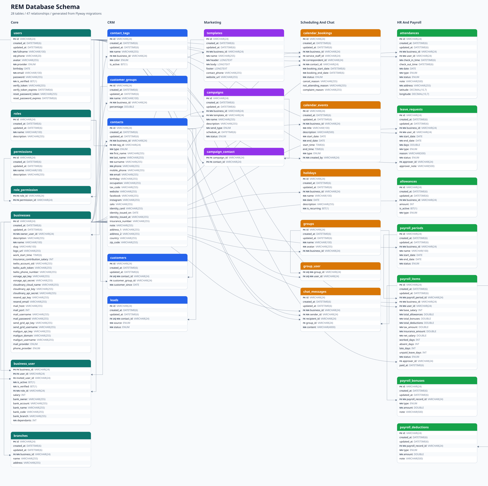

# REM Database Schema & Relationships



Source of truth: Flyway migrations in `rem-server/src/main/resources/db/migrations`.

This schema currently contains 28 tables and 47 foreign-key relationships. The DBML source used by dbdiagram CLI is `docs/database-schema.dbml`.

## Relationship Summary

| Child table | Column | Parent table | Column | Cardinality | Constraint |
| --- | --- | --- | --- | --- | --- |
| `role_permission` | `role_id` | `roles` | `id` | `n:1` | `fk_role_permission_role` |
| `role_permission` | `permission_id` | `permissions` | `id` | `n:1` | `fk_role_permission_permission` |
| `businesses` | `owner_user_id` | `users` | `id` | `n:1` | `fk_businesses_owner` |
| `business_user` | `business_id` | `businesses` | `id` | `n:1` | `fk_business_user_business` |
| `business_user` | `user_id` | `users` | `id` | `n:1` | `fk_business_user_user` |
| `business_user` | `invited_user_id` | `users` | `id` | `0..n:1` | `fk_business_user_invited_user` |
| `business_user` | `role_id` | `roles` | `id` | `n:1` | `fk_business_user_role` |
| `branches` | `business_id` | `businesses` | `id` | `n:1` | `fk_branches_business` |
| `contact_tags` | `business_id` | `businesses` | `id` | `n:1` | `fk_contact_tags_business` |
| `customer_groups` | `business_id` | `businesses` | `id` | `n:1` | `fk_customer_groups_business` |
| `contacts` | `business_id` | `businesses` | `id` | `n:1` | `fk_contacts_business` |
| `contacts` | `tag_id` | `contact_tags` | `id` | `n:1` | `fk_contacts_tag` |
| `customers` | `contact_id` | `contacts` | `id` | `1:1` | `fk_customers_contact` |
| `customers` | `customer_group_id` | `customer_groups` | `id` | `0..n:1` | `fk_customers_customer_group` |
| `leads` | `contact_id` | `contacts` | `id` | `1:1` | `fk_leads_contact` |
| `templates` | `business_id` | `businesses` | `id` | `n:1` | `fk_templates_business` |
| `campaigns` | `business_id` | `businesses` | `id` | `n:1` | `fk_campaigns_business` |
| `campaigns` | `template_id` | `templates` | `id` | `n:1` | `fk_campaigns_template` |
| `campaign_contact` | `campaign_id` | `campaigns` | `id` | `n:1` | `fk_campaign_contact_campaign` |
| `campaign_contact` | `contact_id` | `contacts` | `id` | `n:1` | `fk_campaign_contact_contact` |
| `calendar_bookings` | `business_id` | `businesses` | `id` | `n:1` | `fk_calendar_bookings_business` |
| `calendar_bookings` | `service_staff_id` | `users` | `id` | `0..n:1` | `fk_calendar_bookings_service_staff` |
| `calendar_bookings` | `correspondent_id` | `users` | `id` | `0..n:1` | `fk_calendar_bookings_correspondent` |
| `calendar_bookings` | `contact_id` | `contacts` | `id` | `n:1` | `fk_calendar_bookings_contact` |
| `calendar_events` | `business_id` | `businesses` | `id` | `n:1` | `fk_calendar_events_business` |
| `calendar_events` | `created_by` | `users` | `id` | `n:1` | `fk_calendar_events_created_by` |
| `groups` | `business_id` | `businesses` | `id` | `n:1` | `fk_groups_business` |
| `group_user` | `group_id` | `groups` | `id` | `n:1` | `fk_group_user_group` |
| `group_user` | `user_id` | `users` | `id` | `n:1` | `fk_group_user_user` |
| `chat_messages` | `business_id` | `businesses` | `id` | `n:1` | `fk_chat_messages_business` |
| `chat_messages` | `sender_id` | `users` | `id` | `n:1` | `fk_chat_messages_sender` |
| `chat_messages` | `recipient_id` | `users` | `id` | `0..n:1` | `fk_chat_messages_recipient` |
| `chat_messages` | `group_id` | `groups` | `id` | `0..n:1` | `fk_chat_messages_group` |
| `attendances` | `business_id` | `businesses` | `id` | `n:1` | `fk_attendances_business` |
| `attendances` | `user_id` | `users` | `id` | `n:1` | `fk_attendances_user` |
| `holidays` | `business_id` | `businesses` | `id` | `n:1` | `fk_holidays_business` |
| `leave_requests` | `business_id` | `businesses` | `id` | `n:1` | `fk_leave_requests_business` |
| `leave_requests` | `user_id` | `users` | `id` | `n:1` | `fk_leave_requests_user` |
| `leave_requests` | `approver_id` | `users` | `id` | `0..n:1` | `fk_leave_requests_approver` |
| `allowances` | `business_id` | `businesses` | `id` | `n:1` | `fk_allowances_business` |
| `payroll_periods` | `business_id` | `businesses` | `id` | `n:1` | `fk_payroll_periods_business` |
| `payroll_items` | `payroll_period_id` | `payroll_periods` | `id` | `n:1` | `fk_payroll_items_payroll_period` |
| `payroll_items` | `business_id` | `businesses` | `id` | `n:1` | `fk_payroll_items_business` |
| `payroll_items` | `user_id` | `users` | `id` | `n:1` | `fk_payroll_items_user` |
| `payroll_items` | `approver_id` | `users` | `id` | `0..n:1` | `fk_payroll_items_approver` |
| `payroll_bonuses` | `payroll_record_id` | `payroll_items` | `id` | `n:1` | `fk_payroll_bonuses_payroll_item` |
| `payroll_deductions` | `payroll_record_id` | `payroll_items` | `id` | `n:1` | `fk_payroll_deductions_payroll_item` |

## Tables

### Core

#### `users`

- Primary key: `id`
- Foreign keys: none
- Unique constraints: `uk_users_phone`: `phone`

```sql
CREATE TABLE `users` (
    `id` VARCHAR(24) NOT NULL,
    `created_at` DATETIME(6) NULL,
    `updated_at` DATETIME(6) NULL,
    `fullname` VARCHAR(100) NOT NULL,
    `phone` VARCHAR(20) NULL,
    `avatar` VARCHAR(255) NULL,
    `provider` ENUM('LOCAL','FACEBOOK','GOOGLE') NOT NULL,
    `birthday` DATE NULL,
    `email` VARCHAR(100) NOT NULL,
    `password` VARCHAR(255) NULL,
    `is_verified` BIT(1) NOT NULL,
    `verify_token` VARCHAR(255) NULL,
    `verify_token_expires` DATETIME(6) NULL,
    `reset_password_token` VARCHAR(255) NULL,
    `reset_password_expires` DATETIME(6) NULL,
    PRIMARY KEY (`id`),
    CONSTRAINT `uk_users_phone` UNIQUE (`phone`)
) ENGINE=InnoDB DEFAULT CHARSET=utf8mb4 COLLATE=utf8mb4_unicode_ci;
```

#### `roles`

- Primary key: `id`
- Foreign keys: none

```sql
CREATE TABLE `roles` (
    `id` VARCHAR(24) NOT NULL,
    `created_at` DATETIME(6) NULL,
    `updated_at` DATETIME(6) NULL,
    `name` VARCHAR(100) NOT NULL,
    `description` VARCHAR(255) NULL,
    PRIMARY KEY (`id`)
) ENGINE=InnoDB DEFAULT CHARSET=utf8mb4 COLLATE=utf8mb4_unicode_ci;
```

#### `permissions`

- Primary key: `id`
- Foreign keys: none

```sql
CREATE TABLE `permissions` (
    `id` VARCHAR(24) NOT NULL,
    `created_at` DATETIME(6) NULL,
    `updated_at` DATETIME(6) NULL,
    `name` VARCHAR(100) NOT NULL,
    `description` VARCHAR(255) NULL,
    PRIMARY KEY (`id`)
) ENGINE=InnoDB DEFAULT CHARSET=utf8mb4 COLLATE=utf8mb4_unicode_ci;
```

#### `role_permission`

- Primary key: `role_id, permission_id`
- Foreign keys: `fk_role_permission_role`: `role_id` -> `roles(id)`; `fk_role_permission_permission`: `permission_id` -> `permissions(id)`

```sql
CREATE TABLE `role_permission` (
    `role_id` VARCHAR(24) NOT NULL,
    `permission_id` VARCHAR(24) NOT NULL,
    PRIMARY KEY (`role_id`, `permission_id`),
    KEY `idx_role_permission_permission_id` (`permission_id`),
    CONSTRAINT `fk_role_permission_role` FOREIGN KEY (`role_id`) REFERENCES `roles` (`id`),
    CONSTRAINT `fk_role_permission_permission` FOREIGN KEY (`permission_id`) REFERENCES `permissions` (`id`)
) ENGINE=InnoDB DEFAULT CHARSET=utf8mb4 COLLATE=utf8mb4_unicode_ci;
```

#### `businesses`

- Primary key: `id`
- Foreign keys: `fk_businesses_owner`: `owner_user_id` -> `users(id)`

```sql
CREATE TABLE `businesses` (
    `id` VARCHAR(24) NOT NULL,
    `created_at` DATETIME(6) NULL,
    `updated_at` DATETIME(6) NULL,
    `owner_user_id` VARCHAR(24) NOT NULL,
    `description` VARCHAR(255) NULL,
    `name` VARCHAR(100) NOT NULL,
    `slug` VARCHAR(100) NULL,
    `logo_url` VARCHAR(255) NULL,
    `work_start_time` TIME(6) NULL,
    `insurance_contribution_salary` INT NULL,
    `twilio_account_sid` VARCHAR(255) NULL,
    `twilio_auth_token` VARCHAR(255) NULL,
    `twilio_phone_number` VARCHAR(255) NULL,
    `vonage_api_key` VARCHAR(255) NULL,
    `vonage_api_secret` VARCHAR(255) NULL,
    `cloudinary_cloud_name` VARCHAR(255) NULL,
    `cloudinary_api_key` VARCHAR(255) NULL,
    `cloudinary_api_secret` VARCHAR(255) NULL,
    `resend_api_key` VARCHAR(255) NULL,
    `resend_email` VARCHAR(255) NULL,
    `mail_host` VARCHAR(255) NULL,
    `mail_port` INT NULL,
    `mail_username` VARCHAR(255) NULL,
    `mail_password` VARCHAR(255) NULL,
    `send_grid_api_key` VARCHAR(255) NULL,
    `send_grid_username` VARCHAR(255) NULL,
    `mailgun_api_key` VARCHAR(255) NULL,
    `mailgun_domain` VARCHAR(255) NULL,
    `mailgun_username` VARCHAR(255) NULL,
    `mail_provider` ENUM('SMTP','EXCHANGE','SENDGRID','RESEND','MAILGUN','AMAZON_SES','POSTMARK','OTHER') NULL,
    `phone_provider` ENUM('TWILIO','VONAGE','OTHER') NULL,
    PRIMARY KEY (`id`),
    KEY `idx_businesses_owner_user_id` (`owner_user_id`),
    CONSTRAINT `fk_businesses_owner` FOREIGN KEY (`owner_user_id`) REFERENCES `users` (`id`)
) ENGINE=InnoDB DEFAULT CHARSET=utf8mb4 COLLATE=utf8mb4_unicode_ci;
```

#### `business_user`

- Primary key: `business_id, user_id`
- Foreign keys: `fk_business_user_business`: `business_id` -> `businesses(id)`; `fk_business_user_user`: `user_id` -> `users(id)`; `fk_business_user_invited_user`: `invited_user_id` -> `users(id)`; `fk_business_user_role`: `role_id` -> `roles(id)`

```sql
CREATE TABLE `business_user` (
    `business_id` VARCHAR(24) NOT NULL,
    `user_id` VARCHAR(24) NOT NULL,
    `invited_user_id` VARCHAR(24) NULL,
    `is_active` BIT(1) NOT NULL,
    `is_verified` BIT(1) NOT NULL,
    `role_id` VARCHAR(24) NOT NULL,
    `salary` INT NULL,
    `bank_owner` VARCHAR(255) NULL,
    `bank_account` VARCHAR(255) NULL,
    `bank_name` VARCHAR(255) NULL,
    `bank_code` VARCHAR(255) NULL,
    `bank_branch` VARCHAR(255) NULL,
    `dependants` INT NOT NULL,
    PRIMARY KEY (`business_id`, `user_id`),
    KEY `idx_business_user_user_id` (`user_id`),
    KEY `idx_business_user_invited_user_id` (`invited_user_id`),
    KEY `idx_business_user_role_id` (`role_id`),
    CONSTRAINT `fk_business_user_business` FOREIGN KEY (`business_id`) REFERENCES `businesses` (`id`),
    CONSTRAINT `fk_business_user_user` FOREIGN KEY (`user_id`) REFERENCES `users` (`id`),
    CONSTRAINT `fk_business_user_invited_user` FOREIGN KEY (`invited_user_id`) REFERENCES `users` (`id`),
    CONSTRAINT `fk_business_user_role` FOREIGN KEY (`role_id`) REFERENCES `roles` (`id`)
) ENGINE=InnoDB DEFAULT CHARSET=utf8mb4 COLLATE=utf8mb4_unicode_ci;
```

#### `branches`

- Primary key: `id`
- Foreign keys: `fk_branches_business`: `business_id` -> `businesses(id)`

```sql
CREATE TABLE `branches` (
    `id` VARCHAR(24) NOT NULL,
    `created_at` DATETIME(6) NULL,
    `updated_at` DATETIME(6) NULL,
    `business_id` VARCHAR(24) NOT NULL,
    `name` VARCHAR(255) NULL,
    `address` VARCHAR(255) NULL,
    PRIMARY KEY (`id`),
    KEY `idx_branches_business_id` (`business_id`),
    CONSTRAINT `fk_branches_business` FOREIGN KEY (`business_id`) REFERENCES `businesses` (`id`)
) ENGINE=InnoDB DEFAULT CHARSET=utf8mb4 COLLATE=utf8mb4_unicode_ci;
```

### CRM

#### `contact_tags`

- Primary key: `id`
- Foreign keys: `fk_contact_tags_business`: `business_id` -> `businesses(id)`

```sql
CREATE TABLE `contact_tags` (
    `id` VARCHAR(24) NOT NULL,
    `created_at` DATETIME(6) NULL,
    `updated_at` DATETIME(6) NULL,
    `name` VARCHAR(255) NOT NULL,
    `business_id` VARCHAR(24) NOT NULL,
    `color` ENUM('RED','GREEN','BLUE','YELLOW','ORANGE','PURPLE','PINK','BROWN','GRAY') NOT NULL,
    `is_active` BIT(1) NULL,
    PRIMARY KEY (`id`),
    KEY `idx_contact_tags_business_id` (`business_id`),
    CONSTRAINT `fk_contact_tags_business` FOREIGN KEY (`business_id`) REFERENCES `businesses` (`id`)
) ENGINE=InnoDB DEFAULT CHARSET=utf8mb4 COLLATE=utf8mb4_unicode_ci;
```

#### `customer_groups`

- Primary key: `id`
- Foreign keys: `fk_customer_groups_business`: `business_id` -> `businesses(id)`

```sql
CREATE TABLE `customer_groups` (
    `id` VARCHAR(24) NOT NULL,
    `created_at` DATETIME(6) NULL,
    `updated_at` DATETIME(6) NULL,
    `name` VARCHAR(100) NOT NULL,
    `business_id` VARCHAR(24) NOT NULL,
    `percentage` DOUBLE NULL,
    PRIMARY KEY (`id`),
    KEY `idx_customer_groups_business_id` (`business_id`),
    CONSTRAINT `fk_customer_groups_business` FOREIGN KEY (`business_id`) REFERENCES `businesses` (`id`)
) ENGINE=InnoDB DEFAULT CHARSET=utf8mb4 COLLATE=utf8mb4_unicode_ci;
```

#### `contacts`

- Primary key: `id`
- Foreign keys: `fk_contacts_business`: `business_id` -> `businesses(id)`; `fk_contacts_tag`: `tag_id` -> `contact_tags(id)`

```sql
CREATE TABLE `contacts` (
    `id` VARCHAR(24) NOT NULL,
    `created_at` DATETIME(6) NULL,
    `updated_at` DATETIME(6) NULL,
    `business_id` VARCHAR(24) NOT NULL,
    `tag_id` VARCHAR(24) NOT NULL,
    `type` ENUM('PERSONAL','COMPANY') NOT NULL,
    `first_name` VARCHAR(255) NOT NULL,
    `last_name` VARCHAR(255) NOT NULL,
    `surname` VARCHAR(255) NOT NULL,
    `phone` VARCHAR(255) NOT NULL,
    `mobile_phone` VARCHAR(255) NULL,
    `email` VARCHAR(255) NOT NULL,
    `birthday` VARCHAR(255) NULL,
    `occupation` VARCHAR(255) NULL,
    `tax_code` VARCHAR(255) NULL,
    `website` VARCHAR(255) NULL,
    `facebook` VARCHAR(255) NULL,
    `instagram` VARCHAR(255) NULL,
    `zalo` VARCHAR(255) NULL,
    `identity_card` VARCHAR(255) NULL,
    `identity_issued_on` DATE NULL,
    `identity_issued_at` VARCHAR(255) NULL,
    `insurance_number` VARCHAR(255) NULL,
    `note` VARCHAR(255) NULL,
    `address_1` VARCHAR(255) NULL,
    `address_2` VARCHAR(255) NULL,
    `country` VARCHAR(255) NULL,
    `zip_code` VARCHAR(255) NULL,
    PRIMARY KEY (`id`),
    KEY `idx_contacts_business_id` (`business_id`),
    KEY `idx_contacts_tag_id` (`tag_id`),
    CONSTRAINT `fk_contacts_business` FOREIGN KEY (`business_id`) REFERENCES `businesses` (`id`),
    CONSTRAINT `fk_contacts_tag` FOREIGN KEY (`tag_id`) REFERENCES `contact_tags` (`id`)
) ENGINE=InnoDB DEFAULT CHARSET=utf8mb4 COLLATE=utf8mb4_unicode_ci;
```

#### `customers`

- Primary key: `id`
- Foreign keys: `fk_customers_contact`: `contact_id` -> `contacts(id)`; `fk_customers_customer_group`: `customer_group_id` -> `customer_groups(id)`
- Unique constraints: `uk_customers_contact_id`: `contact_id`

```sql
CREATE TABLE `customers` (
    `id` VARCHAR(24) NOT NULL,
    `created_at` DATETIME(6) NULL,
    `updated_at` DATETIME(6) NULL,
    `contact_id` VARCHAR(24) NOT NULL,
    `customer_group_id` VARCHAR(24) NULL,
    `customer_since` DATE NOT NULL,
    PRIMARY KEY (`id`),
    CONSTRAINT `uk_customers_contact_id` UNIQUE (`contact_id`),
    KEY `idx_customers_customer_group_id` (`customer_group_id`),
    CONSTRAINT `fk_customers_contact` FOREIGN KEY (`contact_id`) REFERENCES `contacts` (`id`),
    CONSTRAINT `fk_customers_customer_group` FOREIGN KEY (`customer_group_id`) REFERENCES `customer_groups` (`id`)
) ENGINE=InnoDB DEFAULT CHARSET=utf8mb4 COLLATE=utf8mb4_unicode_ci;
```

#### `leads`

- Primary key: `id`
- Foreign keys: `fk_leads_contact`: `contact_id` -> `contacts(id)`
- Unique constraints: `uk_leads_contact_id`: `contact_id`

```sql
CREATE TABLE `leads` (
    `id` VARCHAR(24) NOT NULL,
    `created_at` DATETIME(6) NULL,
    `updated_at` DATETIME(6) NULL,
    `contact_id` VARCHAR(24) NOT NULL,
    `source` ENUM('WEBSITE','LANDING_PAGE','CONTACT_FORM','LIVE_CHAT','CHATBOT','MOBILE_APP','PHONE_CALL','EMAIL','SMS','WHATSAPP','FACEBOOK','INSTAGRAM','LINKEDIN','TIKTOK','YOUTUBE','X_TWITTER','ZALO','GOOGLE_ORGANIC','BING_ORGANIC','OTHER_SEARCH_ENGINE','GOOGLE_ADS','FACEBOOK_ADS','INSTAGRAM_ADS','LINKEDIN_ADS','TIKTOK_ADS','YOUTUBE_ADS','DISPLAY_ADS','RETARGETING_ADS','REFERRAL','CUSTOMER_REFERRAL','PARTNER_REFERRAL','EMPLOYEE_REFERRAL','PARTNER','AFFILIATE','RESELLER','DISTRIBUTOR','EVENT','TRADE_SHOW','CONFERENCE','SEMINAR','WEBINAR','NETWORKING','WALK_IN','STORE_VISIT','QR_CODE','DIRECT_MAIL','COLD_CALL','COLD_EMAIL','OUTBOUND_SALES','MARKETPLACE','API','THIRD_PARTY_INTEGRATION','IMPORT','CSV_IMPORT','OTHER','UNKNOWN') NOT NULL,
    `status` ENUM('NEW','ASSIGNED','CONTACT_ATTEMPTED','CONTACTED','ENGAGED','QUALIFIED','NURTURING','ON_HOLD','UNQUALIFIED','DISQUALIFIED','CONVERTED','LOST','DUPLICATE','INVALID','DO_NOT_CONTACT') NOT NULL,
    PRIMARY KEY (`id`),
    CONSTRAINT `uk_leads_contact_id` UNIQUE (`contact_id`),
    CONSTRAINT `fk_leads_contact` FOREIGN KEY (`contact_id`) REFERENCES `contacts` (`id`)
) ENGINE=InnoDB DEFAULT CHARSET=utf8mb4 COLLATE=utf8mb4_unicode_ci;
```

### Marketing

#### `templates`

- Primary key: `id`
- Foreign keys: `fk_templates_business`: `business_id` -> `businesses(id)`

```sql
CREATE TABLE `templates` (
    `id` VARCHAR(24) NOT NULL,
    `created_at` DATETIME(6) NULL,
    `updated_at` DATETIME(6) NULL,
    `business_id` VARCHAR(24) NOT NULL,
    `name` VARCHAR(255) NOT NULL,
    `header` LONGTEXT NOT NULL,
    `body` LONGTEXT NOT NULL,
    `footer` LONGTEXT NULL,
    `contact_phone` VARCHAR(255) NULL,
    `website_url` VARCHAR(255) NULL,
    PRIMARY KEY (`id`),
    KEY `idx_templates_business_id` (`business_id`),
    CONSTRAINT `fk_templates_business` FOREIGN KEY (`business_id`) REFERENCES `businesses` (`id`)
) ENGINE=InnoDB DEFAULT CHARSET=utf8mb4 COLLATE=utf8mb4_unicode_ci;
```

#### `campaigns`

- Primary key: `id`
- Foreign keys: `fk_campaigns_business`: `business_id` -> `businesses(id)`; `fk_campaigns_template`: `template_id` -> `templates(id)`

```sql
CREATE TABLE `campaigns` (
    `id` VARCHAR(24) NOT NULL,
    `created_at` DATETIME(6) NULL,
    `updated_at` DATETIME(6) NULL,
    `business_id` VARCHAR(24) NOT NULL,
    `template_id` VARCHAR(24) NOT NULL,
    `name` VARCHAR(255) NOT NULL,
    `description` VARCHAR(255) NULL,
    `send_type` ENUM('IMMEDIATE','SCHEDULED') NOT NULL,
    `schedule_at` DATETIME(6) NULL,
    `status` ENUM('PENDING','PROCESSING','SENT','FAILED') NOT NULL,
    PRIMARY KEY (`id`),
    KEY `idx_campaigns_business_id` (`business_id`),
    KEY `idx_campaigns_template_id` (`template_id`),
    CONSTRAINT `fk_campaigns_business` FOREIGN KEY (`business_id`) REFERENCES `businesses` (`id`),
    CONSTRAINT `fk_campaigns_template` FOREIGN KEY (`template_id`) REFERENCES `templates` (`id`)
) ENGINE=InnoDB DEFAULT CHARSET=utf8mb4 COLLATE=utf8mb4_unicode_ci;
```

#### `campaign_contact`

- Primary key: `campaign_id, contact_id`
- Foreign keys: `fk_campaign_contact_campaign`: `campaign_id` -> `campaigns(id)`; `fk_campaign_contact_contact`: `contact_id` -> `contacts(id)`

```sql
CREATE TABLE `campaign_contact` (
    `campaign_id` VARCHAR(24) NOT NULL,
    `contact_id` VARCHAR(24) NOT NULL,
    PRIMARY KEY (`campaign_id`, `contact_id`),
    KEY `idx_campaign_contact_contact_id` (`contact_id`),
    CONSTRAINT `fk_campaign_contact_campaign` FOREIGN KEY (`campaign_id`) REFERENCES `campaigns` (`id`),
    CONSTRAINT `fk_campaign_contact_contact` FOREIGN KEY (`contact_id`) REFERENCES `contacts` (`id`)
) ENGINE=InnoDB DEFAULT CHARSET=utf8mb4 COLLATE=utf8mb4_unicode_ci;
```

### Scheduling And Chat

#### `calendar_bookings`

- Primary key: `id`
- Foreign keys: `fk_calendar_bookings_business`: `business_id` -> `businesses(id)`; `fk_calendar_bookings_service_staff`: `service_staff_id` -> `users(id)`; `fk_calendar_bookings_correspondent`: `correspondent_id` -> `users(id)`; `fk_calendar_bookings_contact`: `contact_id` -> `contacts(id)`

```sql
CREATE TABLE `calendar_bookings` (
    `id` VARCHAR(24) NOT NULL,
    `created_at` DATETIME(6) NULL,
    `updated_at` DATETIME(6) NULL,
    `business_id` VARCHAR(24) NOT NULL,
    `service_staff_id` VARCHAR(24) NULL,
    `correspondent_id` VARCHAR(24) NULL,
    `contact_id` VARCHAR(24) NOT NULL,
    `booking_start_date` DATETIME(6) NOT NULL,
    `booking_end_date` DATETIME(6) NOT NULL,
    `status` ENUM('WAITING','BOOKED','COMPLETED','CANCELLED','ABSENT','ARRIVED','IN_ROOM','BOUGHT_SERVICE') NOT NULL,
    `cancel_reason` VARCHAR(255) NULL,
    `not_attending_reason` VARCHAR(255) NULL,
    `complaint_reason` VARCHAR(255) NULL,
    PRIMARY KEY (`id`),
    KEY `idx_calendar_bookings_business_id` (`business_id`),
    KEY `idx_calendar_bookings_service_staff_id` (`service_staff_id`),
    KEY `idx_calendar_bookings_correspondent_id` (`correspondent_id`),
    KEY `idx_calendar_bookings_contact_id` (`contact_id`),
    CONSTRAINT `fk_calendar_bookings_business` FOREIGN KEY (`business_id`) REFERENCES `businesses` (`id`),
    CONSTRAINT `fk_calendar_bookings_service_staff` FOREIGN KEY (`service_staff_id`) REFERENCES `users` (`id`),
    CONSTRAINT `fk_calendar_bookings_correspondent` FOREIGN KEY (`correspondent_id`) REFERENCES `users` (`id`),
    CONSTRAINT `fk_calendar_bookings_contact` FOREIGN KEY (`contact_id`) REFERENCES `contacts` (`id`)
) ENGINE=InnoDB DEFAULT CHARSET=utf8mb4 COLLATE=utf8mb4_unicode_ci;
```

#### `calendar_events`

- Primary key: `id`
- Foreign keys: `fk_calendar_events_business`: `business_id` -> `businesses(id)`; `fk_calendar_events_created_by`: `created_by` -> `users(id)`

```sql
CREATE TABLE `calendar_events` (
    `id` VARCHAR(24) NOT NULL,
    `created_at` DATETIME(6) NULL,
    `updated_at` DATETIME(6) NULL,
    `business_id` VARCHAR(24) NOT NULL,
    `title` VARCHAR(100) NOT NULL,
    `description` VARCHAR(500) NULL,
    `start_date` DATE NOT NULL,
    `end_date` DATE NOT NULL,
    `start_time` TIME(6) NULL,
    `end_time` TIME(6) NULL,
    `type` ENUM('HOLIDAY','MEETING','LEAVE','ANNOUNCEMENT') NOT NULL,
    `created_by` VARCHAR(24) NOT NULL,
    PRIMARY KEY (`id`),
    KEY `idx_calendar_events_business_id` (`business_id`),
    KEY `idx_calendar_events_created_by` (`created_by`),
    CONSTRAINT `fk_calendar_events_business` FOREIGN KEY (`business_id`) REFERENCES `businesses` (`id`),
    CONSTRAINT `fk_calendar_events_created_by` FOREIGN KEY (`created_by`) REFERENCES `users` (`id`)
) ENGINE=InnoDB DEFAULT CHARSET=utf8mb4 COLLATE=utf8mb4_unicode_ci;
```

#### `holidays`

- Primary key: `id`
- Foreign keys: `fk_holidays_business`: `business_id` -> `businesses(id)`

```sql
CREATE TABLE `holidays` (
    `id` VARCHAR(24) NOT NULL,
    `created_at` DATETIME(6) NULL,
    `updated_at` DATETIME(6) NULL,
    `business_id` VARCHAR(24) NOT NULL,
    `name` VARCHAR(100) NOT NULL,
    `date` DATE NOT NULL,
    `description` VARCHAR(255) NULL,
    `is_recurring` BIT(1) NOT NULL,
    PRIMARY KEY (`id`),
    KEY `idx_holidays_business_id` (`business_id`),
    CONSTRAINT `fk_holidays_business` FOREIGN KEY (`business_id`) REFERENCES `businesses` (`id`)
) ENGINE=InnoDB DEFAULT CHARSET=utf8mb4 COLLATE=utf8mb4_unicode_ci;
```

#### `groups`

- Primary key: `id`
- Foreign keys: `fk_groups_business`: `business_id` -> `businesses(id)`

```sql
CREATE TABLE `groups` (
    `id` VARCHAR(24) NOT NULL,
    `created_at` DATETIME(6) NULL,
    `updated_at` DATETIME(6) NULL,
    `name` VARCHAR(100) NOT NULL,
    `avatar` VARCHAR(255) NOT NULL,
    `business_id` VARCHAR(24) NOT NULL,
    PRIMARY KEY (`id`),
    KEY `idx_groups_business_id` (`business_id`),
    CONSTRAINT `fk_groups_business` FOREIGN KEY (`business_id`) REFERENCES `businesses` (`id`)
) ENGINE=InnoDB DEFAULT CHARSET=utf8mb4 COLLATE=utf8mb4_unicode_ci;
```

#### `group_user`

- Primary key: `group_id, user_id`
- Foreign keys: `fk_group_user_group`: `group_id` -> `groups(id)`; `fk_group_user_user`: `user_id` -> `users(id)`

```sql
CREATE TABLE `group_user` (
    `group_id` VARCHAR(24) NOT NULL,
    `user_id` VARCHAR(24) NOT NULL,
    PRIMARY KEY (`group_id`, `user_id`),
    KEY `idx_group_user_user_id` (`user_id`),
    CONSTRAINT `fk_group_user_group` FOREIGN KEY (`group_id`) REFERENCES `groups` (`id`),
    CONSTRAINT `fk_group_user_user` FOREIGN KEY (`user_id`) REFERENCES `users` (`id`)
) ENGINE=InnoDB DEFAULT CHARSET=utf8mb4 COLLATE=utf8mb4_unicode_ci;
```

#### `chat_messages`

- Primary key: `id`
- Foreign keys: `fk_chat_messages_business`: `business_id` -> `businesses(id)`; `fk_chat_messages_sender`: `sender_id` -> `users(id)`; `fk_chat_messages_recipient`: `recipient_id` -> `users(id)`; `fk_chat_messages_group`: `group_id` -> `groups(id)`

```sql
CREATE TABLE `chat_messages` (
    `id` VARCHAR(24) NOT NULL,
    `created_at` DATETIME(6) NULL,
    `updated_at` DATETIME(6) NULL,
    `business_id` VARCHAR(24) NOT NULL,
    `sender_id` VARCHAR(24) NOT NULL,
    `recipient_id` VARCHAR(24) NULL,
    `group_id` VARCHAR(24) NULL,
    `content` VARCHAR(4000) NOT NULL,
    PRIMARY KEY (`id`),
    KEY `idx_chat_business_sender_recipient_created` (`business_id`, `sender_id`, `recipient_id`, `created_at`),
    KEY `idx_chat_business_recipient_sender_created` (`business_id`, `recipient_id`, `sender_id`, `created_at`),
    KEY `idx_chat_business_group_created` (`business_id`, `group_id`, `created_at`),
    KEY `idx_chat_messages_sender_id` (`sender_id`),
    KEY `idx_chat_messages_recipient_id` (`recipient_id`),
    KEY `idx_chat_messages_group_id` (`group_id`),
    CONSTRAINT `fk_chat_messages_business` FOREIGN KEY (`business_id`) REFERENCES `businesses` (`id`),
    CONSTRAINT `fk_chat_messages_sender` FOREIGN KEY (`sender_id`) REFERENCES `users` (`id`),
    CONSTRAINT `fk_chat_messages_recipient` FOREIGN KEY (`recipient_id`) REFERENCES `users` (`id`),
    CONSTRAINT `fk_chat_messages_group` FOREIGN KEY (`group_id`) REFERENCES `groups` (`id`)
) ENGINE=InnoDB DEFAULT CHARSET=utf8mb4 COLLATE=utf8mb4_unicode_ci;
```

### HR And Payroll

#### `attendances`

- Primary key: `id`
- Foreign keys: `fk_attendances_business`: `business_id` -> `businesses(id)`; `fk_attendances_user`: `user_id` -> `users(id)`

```sql
CREATE TABLE `attendances` (
    `id` VARCHAR(24) NOT NULL,
    `created_at` DATETIME(6) NULL,
    `updated_at` DATETIME(6) NULL,
    `business_id` VARCHAR(24) NOT NULL,
    `user_id` VARCHAR(24) NOT NULL,
    `check_in_time` DATETIME(6) NOT NULL,
    `check_out_time` DATETIME(6) NULL,
    `date` DATE NOT NULL,
    `type` ENUM('OFFICE','REMOTE','HYBRID') NOT NULL,
    `status` ENUM('ON_TIME','LATE','HALF_DAY') NOT NULL,
    `note` VARCHAR(500) NULL,
    `address` VARCHAR(255) NOT NULL,
    `latitude` DECIMAL(10,7) NULL,
    `longitude` DECIMAL(10,7) NULL,
    PRIMARY KEY (`id`),
    KEY `idx_attendances_business_id` (`business_id`),
    KEY `idx_attendances_user_id` (`user_id`),
    CONSTRAINT `fk_attendances_business` FOREIGN KEY (`business_id`) REFERENCES `businesses` (`id`),
    CONSTRAINT `fk_attendances_user` FOREIGN KEY (`user_id`) REFERENCES `users` (`id`)
) ENGINE=InnoDB DEFAULT CHARSET=utf8mb4 COLLATE=utf8mb4_unicode_ci;
```

#### `leave_requests`

- Primary key: `id`
- Foreign keys: `fk_leave_requests_business`: `business_id` -> `businesses(id)`; `fk_leave_requests_user`: `user_id` -> `users(id)`; `fk_leave_requests_approver`: `approver_id` -> `users(id)`

```sql
CREATE TABLE `leave_requests` (
    `id` VARCHAR(24) NOT NULL,
    `created_at` DATETIME(6) NULL,
    `updated_at` DATETIME(6) NULL,
    `business_id` VARCHAR(24) NOT NULL,
    `user_id` VARCHAR(24) NOT NULL,
    `start_date` DATE NOT NULL,
    `end_date` DATE NOT NULL,
    `days` DOUBLE NOT NULL,
    `type` ENUM('ANNUAL','SICK','MATERNITY','PATERNITY','UNPAID','BEREAVEMENT','MARRIAGE','COMPENSATORY','EMERGENCY','STUDY','OTHER') NOT NULL,
    `reason` VARCHAR(500) NULL,
    `status` ENUM('PENDING','APPROVED','REJECTED','CANCELLED','EXPIRED') NOT NULL,
    `approver_id` VARCHAR(24) NULL,
    `approver_note` VARCHAR(500) NULL,
    PRIMARY KEY (`id`),
    KEY `idx_leave_requests_business_id` (`business_id`),
    KEY `idx_leave_requests_user_id` (`user_id`),
    KEY `idx_leave_requests_approver_id` (`approver_id`),
    CONSTRAINT `fk_leave_requests_business` FOREIGN KEY (`business_id`) REFERENCES `businesses` (`id`),
    CONSTRAINT `fk_leave_requests_user` FOREIGN KEY (`user_id`) REFERENCES `users` (`id`),
    CONSTRAINT `fk_leave_requests_approver` FOREIGN KEY (`approver_id`) REFERENCES `users` (`id`)
) ENGINE=InnoDB DEFAULT CHARSET=utf8mb4 COLLATE=utf8mb4_unicode_ci;
```

#### `allowances`

- Primary key: `id`
- Foreign keys: `fk_allowances_business`: `business_id` -> `businesses(id)`

```sql
CREATE TABLE `allowances` (
    `id` VARCHAR(24) NOT NULL,
    `created_at` DATETIME(6) NULL,
    `updated_at` DATETIME(6) NULL,
    `business_id` VARCHAR(24) NOT NULL,
    `amount` INT NULL,
    `is_active` BIT(1) NULL,
    `type` ENUM('MEAL','TRANSPORT','HOUSING','PHONE','OTHER') NOT NULL,
    PRIMARY KEY (`id`),
    KEY `idx_allowances_business_id` (`business_id`),
    CONSTRAINT `fk_allowances_business` FOREIGN KEY (`business_id`) REFERENCES `businesses` (`id`)
) ENGINE=InnoDB DEFAULT CHARSET=utf8mb4 COLLATE=utf8mb4_unicode_ci;
```

#### `payroll_periods`

- Primary key: `id`
- Foreign keys: `fk_payroll_periods_business`: `business_id` -> `businesses(id)`

```sql
CREATE TABLE `payroll_periods` (
    `id` VARCHAR(24) NOT NULL,
    `created_at` DATETIME(6) NULL,
    `updated_at` DATETIME(6) NULL,
    `business_id` VARCHAR(24) NOT NULL,
    `name` VARCHAR(100) NOT NULL,
    `start_date` DATE NOT NULL,
    `end_date` DATE NOT NULL,
    `status` ENUM('DRAFT','PROCESSING','APPROVED','PAID','CANCELLED') NOT NULL,
    PRIMARY KEY (`id`),
    KEY `idx_payroll_periods_business_id` (`business_id`),
    CONSTRAINT `fk_payroll_periods_business` FOREIGN KEY (`business_id`) REFERENCES `businesses` (`id`)
) ENGINE=InnoDB DEFAULT CHARSET=utf8mb4 COLLATE=utf8mb4_unicode_ci;
```

#### `payroll_items`

- Primary key: `id`
- Foreign keys: `fk_payroll_items_payroll_period`: `payroll_period_id` -> `payroll_periods(id)`; `fk_payroll_items_business`: `business_id` -> `businesses(id)`; `fk_payroll_items_user`: `user_id` -> `users(id)`; `fk_payroll_items_approver`: `approver_id` -> `users(id)`

```sql
CREATE TABLE `payroll_items` (
    `id` VARCHAR(24) NOT NULL,
    `created_at` DATETIME(6) NULL,
    `updated_at` DATETIME(6) NULL,
    `payroll_period_id` VARCHAR(24) NOT NULL,
    `business_id` VARCHAR(24) NOT NULL,
    `user_id` VARCHAR(24) NOT NULL,
    `base_salary` INT NOT NULL,
    `total_allowances` DOUBLE NOT NULL,
    `total_bonuses` DOUBLE NOT NULL,
    `total_deductions` DOUBLE NOT NULL,
    `tax_amount` DOUBLE NOT NULL,
    `insurance_amount` DOUBLE NOT NULL,
    `net_salary` DOUBLE NOT NULL,
    `worked_days` INT NULL,
    `absent_days` INT NULL,
    `late_days` INT NULL,
    `unpaid_leave_days` INT NULL,
    `status` ENUM('DRAFT','PROCESSING','APPROVED','PAID','CANCELLED') NOT NULL,
    `approver_id` VARCHAR(24) NULL,
    `paid_at` DATETIME(6) NULL,
    PRIMARY KEY (`id`),
    KEY `idx_payroll_items_payroll_period_id` (`payroll_period_id`),
    KEY `idx_payroll_items_business_id` (`business_id`),
    KEY `idx_payroll_items_user_id` (`user_id`),
    KEY `idx_payroll_items_approver_id` (`approver_id`),
    CONSTRAINT `fk_payroll_items_payroll_period` FOREIGN KEY (`payroll_period_id`) REFERENCES `payroll_periods` (`id`),
    CONSTRAINT `fk_payroll_items_business` FOREIGN KEY (`business_id`) REFERENCES `businesses` (`id`),
    CONSTRAINT `fk_payroll_items_user` FOREIGN KEY (`user_id`) REFERENCES `users` (`id`),
    CONSTRAINT `fk_payroll_items_approver` FOREIGN KEY (`approver_id`) REFERENCES `users` (`id`)
) ENGINE=InnoDB DEFAULT CHARSET=utf8mb4 COLLATE=utf8mb4_unicode_ci;
```

#### `payroll_bonuses`

- Primary key: `id`
- Foreign keys: `fk_payroll_bonuses_payroll_item`: `payroll_record_id` -> `payroll_items(id)`

```sql
CREATE TABLE `payroll_bonuses` (
    `id` VARCHAR(24) NOT NULL,
    `created_at` DATETIME(6) NULL,
    `updated_at` DATETIME(6) NULL,
    `payroll_record_id` VARCHAR(24) NOT NULL,
    `type` ENUM('PERFORMANCE','HOLIDAY','PROJECT','OTHER') NOT NULL,
    `amount` DOUBLE NOT NULL,
    `note` VARCHAR(500) NULL,
    PRIMARY KEY (`id`),
    KEY `idx_payroll_bonuses_payroll_record_id` (`payroll_record_id`),
    CONSTRAINT `fk_payroll_bonuses_payroll_item` FOREIGN KEY (`payroll_record_id`) REFERENCES `payroll_items` (`id`)
) ENGINE=InnoDB DEFAULT CHARSET=utf8mb4 COLLATE=utf8mb4_unicode_ci;
```

#### `payroll_deductions`

- Primary key: `id`
- Foreign keys: `fk_payroll_deductions_payroll_item`: `payroll_record_id` -> `payroll_items(id)`

```sql
CREATE TABLE `payroll_deductions` (
    `id` VARCHAR(24) NOT NULL,
    `created_at` DATETIME(6) NULL,
    `updated_at` DATETIME(6) NULL,
    `payroll_record_id` VARCHAR(24) NOT NULL,
    `type` ENUM('TAX','INSURANCE','LATE','ABSENT','UNPAID_LEAVE','OTHER') NOT NULL,
    `amount` DOUBLE NOT NULL,
    `note` VARCHAR(500) NULL,
    PRIMARY KEY (`id`),
    KEY `idx_payroll_deductions_payroll_record_id` (`payroll_record_id`),
    CONSTRAINT `fk_payroll_deductions_payroll_item` FOREIGN KEY (`payroll_record_id`) REFERENCES `payroll_items` (`id`)
) ENGINE=InnoDB DEFAULT CHARSET=utf8mb4 COLLATE=utf8mb4_unicode_ci;
```
